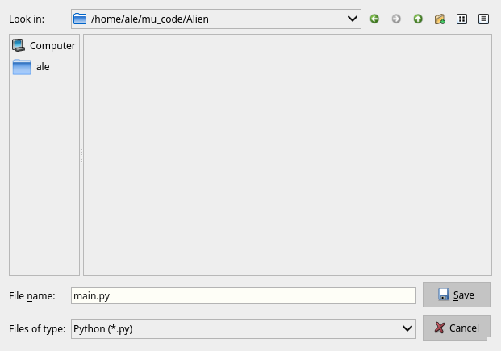
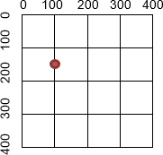

# Introduction to Python: Draw an Alien with PyGame

This is the second part of the introduction to Python for people who cannot program but have already seen code (Scratch, ...)

## Why Python and PyGame?

The only programming language that is used in production for almost all types of programming and has been created with the explicit goal to be easy to read and learn.

PyGame is a simple but _serious_ library for creating 2D games with Python.

    TODO:
    - What is a library?
    - what are 2D games?

Other options:

- Ursina: for 3D games
- microStudio: for a _simple_ IDE
- Godot: a full fledged game framework

## Drawing an interactive alien

We will be using PyGame to draw an alien that reacts to key presses.

TODO: add a gif of the final result

## Setup the environment

- Install Mu-Editor: https://codewith.mu  
  PyGame is already autoamtically installed with Mu-Editor

## First steps

Create a new Python script with the _New_ button


Save it in a new folder called `Alien`, and name it `main.py`




Now let's type some code to show a square window with a yellow background:

> Please, don't copy paste this code: type it line by line, while trying t    o understand what it might be doing)

```py
import pygame

pygame.init()

screen = pygame.display.set_mode((400, 400))
pygame.display.set_caption("Alien")

background_color = pygame.Color('yellow')

done = False
while not done:
    for event in pygame.event.get():
        if event.type == pygame.QUIT:
            done = True

    screen.fill(background_color)
    pygame.display.flip()

pygame.quit()
```

## How does it work?

Let's try to undestand what this script does:

- `pygame.display.set_mode((400, 400))`:  
  Initialize a window or screen for display.  
  <https://www.pygame.org/docs/ref/display.html#pygame.display.set_mode>
- `pygame.display.set_caption("Alien")`:  
  Set the current window title  
  <https://www.pygame.org/docs/ref/display.html#pygame.display.set_caption>
- `background_color = pygame.Color('yellow')`:  
  Define the color to be used for the background  
  <https://www.pygame.org/docs/ref/color_list.html>
- Quit when the window gets closed:  
  ````py
  for event in pygame.event.get():
        if event.type == pygame.QUIT:
            done = True
  ```
- `screen.fill(background_color)`:  
  Set the color for the background.
  <https://www.pygame.org/docs/ref/surface.html#pygame.Surface.fill>
- `pygame.display.flip()`:  
  Update the full display Surface to the screen
  https://www.pygame.org/docs/ref/display.html#pygame.display.flip

For each step, you get a link to the official documentation, where you can find more information about the commands used.

https://www.pygame.org/docs/index.html

## The Coordinates

The drawing of the alien is a composition of multiple shapes, drawn at specific coordinates.

The window we have crated is 400 pixel wide and 400 pixel high. We can address each position in the window with distance from the top left corner.

As an example the red point is at the position `x = 100`, `y = 150`:



## Drawing the Alien

The Alien is drawn with six simple shapes that you can add between the command that fills the yellow background and the `flip()` command that does the actual drawing:

```py
screen.fill(color)

pygame.draw.ellipse(screen, 'green', (100, 150, 200, 100)) # body
pygame.draw.circle(screen, 'white', (200, 100), 30) # eye
pygame.draw.circle(screen, 'black', (200, 100), 10) # pupil
pygame.draw.ellipse(screen, 'red', (150, 220, 100, 20)) # mouth
pygame.draw.line(screen, 'black', (200, 150), (200, 130), 10) # neck
pygame.draw.polygon(screen, 'blue', ((160, 75), (240, 75), (200, 20)))

pygame.display.flip()
```

- The body is a green oval starting at `x = 100`, `y = 150`, 200 wide and 100 heigh:  
  `pygame.draw.ellipse(screen, 'green', (100, 150, 200, 100))`  
  <https://www.pygame.org/docs/ref/draw.html#pygame.draw.ellipse>
- The eye is drawn by two circles at `x = 200`, `y = 100`, a white one with a radius of 30 and a smaller black one of radius 10 on top of it:
  `pygame.draw.circle(screen, 'white', (200, 100), 30)`  
  `pygame.draw.circle(screen, 'black', (200, 100), 10)`  
  <https://www.pygame.org/docs/ref/draw.html#pygame.draw.circle>
- The mouth is a red ellipse.
- The neck is a black line starting at `x = 200`, `y = 150`, and ending at `x = 200`, `y = 130`:  
  `pygame.draw.line(screen, 'black', (200, 150), (200, 130), 10)`  
  <https://www.pygame.org/docs/ref/draw.html#pygame.draw.line>
- The hat is a blue triangle, defined by its points:  
  `pygame.draw.polygon(screen, 'blue', ((160, 75), (240, 75), (200, 20)))`  
  <https://www.pygame.org/docs/ref/draw.html#pygame.draw.polygon>

## Animate the mouth and the eyes

key list: https://www.pygame.org/docs/ref/key.html

TODO: see src/main-animation.py

## Add some text

TODO: add some text with the keys

https://stackoverflow.com/questions/20842801/how-to-display-text-in-pygame
pygame.font.init()
my_font = pygame.freetype.SysFont('Comic Sans MS', 30)
text_surface = my_font.render('Some Text', False, (0, 0, 0))
screen.blit(text_surface, (0,0))

TODO: use surface instead of screen

## Use classes

TODO: create classes with draw functions
