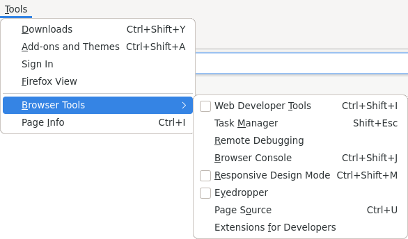
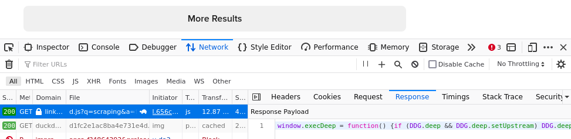

# Scraping with Python {.c}

{width=100px}


# What is _scraping_ {.c}

::: columns

:::: {.column width=50%}

Web scraping, web harvesting, or web data extraction is data scraping used for extracting data from websites.

\vspace{20pt}

_From Wikipedia_

::::

:::: {.column width=50%}

  
cc-by [digboston](https://www.flickr.com/photos/weeklydig/) $\nearrow$

::::

:::

# What is _scraping_ {.c}

::: columns

:::: {.column width=50%}

_Web browsing_:

::::

:::: {.column width=50%}

Going into the internet for information  
(... or entertainment)

::::

:::

\vspace{20pt}

::: columns

:::: {.column width=50%}

_Web scraping_:

::::

:::: {.column width=50%}

Looking for data

Collecting for data

::::

:::


# From Data to Information {.t}

_Data_ is raw, not organized, material which -- after being analyzed -- can be used to derive information.

\vspace{20px}

_Information_ is for humans.

It's about giving significance and usefulness to data through interpretation.

It has a meaning.

# Inspiration: The Swiss Federal Administrative Court PDFs {.t}


[Barnaby Skinner – Scraping the Federal Administrative Court's Database](https://www.youtube.com/watch?v=OWNa8MCfPaA&list=PL4_MBPz5hOsKGgkf74Yalhl--6sRUrOIg&index=7) $\nearrow$, Swiss Python Summit 2017

Starting point:

- The rulings are published as PDFs
- They can be searched through a Web Form
- Does the party affiliation of the judge affect the decisions?

Result:

- Automatically submit the form and get 29'263 verdicts
- "Scrape" the content of the PDFs
- Yes

# Inspiration: Data Journalism {.t}

[Barnaby Skinner](https://www.barnabyskinner.com/about) $\nearrow$ is a Data Journalist -> Data drive story telling

[A selection of data driven investigations, feature stories, interviews and other bits and pieces.](https://www.barnabyskinner.com/stories) $\nearrow$

- [Bundesrichter nicken Urteile oft nur noch ab](https://www.tagesanzeiger.ch/bundesrichter-nicken-urteile-oft-nur-noch-ab-574818666927) $\nearrow$  
  Eine Analyse aller 73'000 Urteile seit 2007 zeigt, wie gross der Einfluss der Gerichtsschreiber auf die Rechtsprechung ist. Hintergrund ist die Beschwerdeflut am obersten Gericht.
- [Die Gutheissungsquoten sinken bei allen Richtern](https://www.tagesanzeiger.ch/die-gutheissungsquoten-sinken-bei-allen-richtern-404322581374) $\nearrow$  
  Der Präsident des Bundesverwaltungsgerichts bezeichnete eine Analyse zu den Asylentscheiden wider besseres Wissen als falsch – zumindest gegen aussen.

# Inspiration: David Kriesel @ ccc

::: columns

:::: {.column width=50%}


::::

:::: {.column width=50%}

[BahnMining - Pünktlichkeit ist eine Zier (David Kriesel)](https://media.ccc.de/v/36c3-10652-bahnmining_-_punktlichkeit_ist_eine_zier) $\nearrow$

\vspace{20pt}

_Result_: you can save money, if you know in advance which train will be delayed by how much.

::::

:::

# Behind the Website {.t}

- Page Source (ctrl + u)
- Web Developer tools (F12)
  - Inspect (Q)



Example: <https://www.pwg.ch/> $\nearrow$

# Snoop the JSON {.t}

- Web Developer tools (F12)
- Network
  - JSON
    - Response



Example: <https://duckduckgo.com> $\nearrow$

# Getting the Website content {.t}

Can we _simply_ get a web page text with Python?

No

What can we easily get?

The HTML source.
And then extract the text from it.

```
$ pip install requests beautifulsoup4
```

```py
import requests
from bs4 import BeautifulSoup

r = requests.get('https://www.tagesanzeiger.ch/' + \
    'die-gutheissungsquoten-sinken-bei-allen-' + \
    'richtern-404322581374')
# print(r.text)
soup = BeautifulSoup(r.text)
print(soup.get_text())
```

# Getting the Website content {.t}

This is what we want \ldots


# Getting the Website content {.t}

This is what we get \ldots

Die Gutheissungsquoten sinken bei allen Richtern | Tages-AnzeigerIhr Browser ist veraltet. Bitte aktualisieren Sie Ihren Browser auf die neueste Version, oder wechseln Sie auf einen anderen Browser wie Chrome, Safari, Firefox  oder Edge um Sicherheitslücken zu vermeiden und eine bestmögliche Performance zu gewährleisten.Zum Hauptinhalt springenTages-AnzeigerSchweizLoginMenüWahlen 2023AbstimmungenBundeshaus SchnellzugriffeNeueste ArtikelDas Wichtigste des TagesE-PaperNewsletter & AlertsPodcastsSchaadzeile/WidmerzeileAboshopcarte blanche & AbovorteileThemen & SchwerpunkteStartseiteSchwerpunkteWahlen 2023ZürichStadtRegionGastroZüritipp(s)KurzmeldungenMeine GemeindeSchweiz \ldots

<https://www.tagesanzeiger.ch/die-gutheissungsquoten-sinken-bei-allen-richtern-404322581374> $\nearrow$

# Looking for Information in the HTML {.t}

- In the browser \ldots
- Open the _Web Developer Tools_ (F12).
- Use the element picker (ctrl-shift-c).
- Often the HTML tag and the CSS classes help identifying where the interesting information is.


# Looking for Information in the HTML {.t}

```py
import requests
from bs4 import BeautifulSoup

r = requests.get('https://www.tagesanzeiger.ch/' + \
    'die-gutheissungsquoten-sinken-bei-allen-' + \
    'richtern-404322581374')
# print(r.text)
soup = BeautifulSoup(r.text)
print(soup.find('figcaption').find('span'))
```

Gives us:

`<span class="HtmlText_root__A1OSq">«Grundsätzlich ist der ‹Tages-Anzeiger› nicht von einer Falschannahme ausgegangen»: Jean-Luc Baechler (SVP), Präsident des Bundesverwaltungsgerichts. Foto: Alessandro della Valle (Keystone)</span>`

# Exploit the structure in the HTML {.t}

We are not limited to the tags! We can also search by CSS class:

```py
print(soup.find('figcaption').find('span', \
    class_='HtmlText_root__A1OSq'))
```

Nice!

As you can guess, `__A10Sq` is some random value, that is only there to make the life harder for the honest scraper.  

You might want to get rid of it \ldots

# Exploit the structure in the HTML {.t}

Luckily, BeautifulSoup has an answer for it.

We can use a RegEx!

```py
print(soup.find('figcaption').find('span', \
    class_=re.compile('^HtmlText_root.*')))
```

Or even a function!

```py
print(soup.find('figcaption').find('span', \
    class_=lambda e: \
        e.startswith('HtmlText_root') \
        if e else False))
```

<!-- P.S: Of course, for simple cases, you can use the Python builtin search or RegEx\ldots, instead of BeautifulSoup -->

# Getting _complex_ pages {.t}

With `requests` and `beautifulsoup4` together we can get far. But, sometimes, we need to run Javascript code to get the full content.

For such cases, you can use `requests-html`, which uses Chromium to build the page as if you were browsing the web:

```py
$ pip install requests-html
```

```py
from requests_html import HTMLSession

session = HTMLSession()
url = 'https://www.nzz.ch/schweiz'
r = session.get(url)
r.html.render(sleep=1, scrolldown=5)
articles = r.html.find('article')
```

# Requests to an API {.t}

```py
import requests

url = 'https://gitlab.com/api/v4/projects/' + \
    'a.l.e%2Fadvent-of-code/repository/commits'
response = requests.get(url)

if response.ok:
    print(response.json()[0]['title'])
else:
    print(response.status_code)
```

- Often, you need to generate (and use) an authetncation token to access (REST) APIs
- Some websites make it harder to access _non official_ APIs. As an example, the DuckDuckGo request we saw before _hides_ the json data Javascript code.

# Open Data {.t}

"Open data is data that is openly accessible, exploitable, editable and shared by anyone for any purpose. Open data is licensed under an open license." ([Wikipedia](https://en.wikipedia.org/wiki/Open_data) $\nearrow$)

- Zürcher Open Data Katalog: <https://data.stadt-zuerich.ch/>
- Swiss Open Government Data: <https://opendata.swiss>

# Caching the request {.t}

There is a [requests-cache](https://pypi.org/project/requests-cache/) for a serious approach to caching your requests to an API.

But that's a bit overkill, if you're just playing around with your ideas and don't want to hit the real server each time you test a different BeautifulSoup query on a specific page.  
Then, you can _simply_ put the result of the request in a local text file and use that instead.

This is more important if you retrieving data from an API that enforces a tight access rate.

# Caching the request {.t}

```py
import requests
from pathlib import Path

requests_cache = Path('./requests-cache.html')
if not requests_cache.is_file():
    r = requests.get('https://www.tagesanzeiger.ch/' + \
        'die-gutheissungsquoten-sinken-bei-allen-' + \
        'richtern-404322581374')
    with open(requests_cache, 'w') as cache_file:
        cache_file.write(r.text)
with open(requests_cache, 'r') as cache_file:
    html = cache_file.read()

print(html)
```

And don't forget to disable the cache when the script goes into production!

# For more information {.t}

- [Beautiful Soup Documentation](https://beautiful-soup-4.readthedocs.io/en/latest/) $\nearrow$
